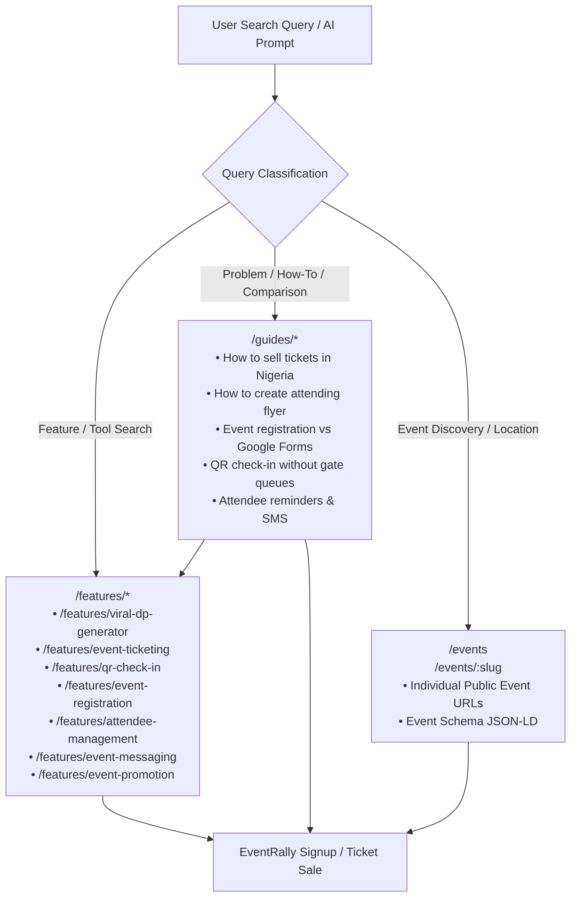

# EventRally — Complete Organic Discoverability Architecture
## Comprehensive Strategy for Traditional SEO, Answer Engine Optimization (AEO), and Generative Engine Optimization (GEO)

**Website**: [https://www.geteventrally.com](https://www.geteventrally.com)  
**Version**: 2.0 (Full Search Engine & Answer Engine Infrastructure)  
**Last Updated**: September 2026  

---

## 1. Executive Summary & Discoverability Philosophy

EventRally is an event operating system and ticketing platform built initially with a strong African/Nigerian focus and scaled for global reliability.

The discoverability architecture is engineered around a core principle: **Attract users who search for the PROBLEM, TASK, FEATURE, ALTERNATIVE, QUESTION, or OUTCOME, even if they have never heard of EventRally.**

We move beyond generic homepage ranking to establish **7 independent feature search clusters**, **6 high-intent educational playbooks**, **dynamic programmatic event discovery**, and **first-class AI/answer-engine readability (AEO / GEO)**.



---

## 2. Search Intent & Keyword Mapping Matrix

Every page is anchored to a distinct, non-cannibalizing search intent cluster.

| Feature Cluster | Primary Intent | Secondary & Long-Tail Queries | Problem / Alternative Queries | Transactional / Action Queries |
| :--- | :--- | :--- | :--- | :--- |
| **Viral DP Generator** (`/features/viral-dp-generator`) | I will be attending flyer generator | event DP maker, attendee flyer generator, I will be there flyer, attending flyer maker, personalized event flyer | how to make attendee flyer without designer, canva event flyer alternative | create I will be attending flyer online, make event DP free |
| **Event Ticketing** (`/features/event-ticketing`) | event ticketing platform Nigeria | sell event tickets online, online event ticketing, event ticketing software Africa, multi-tier ticket sales | how to sell tickets online and get paid directly, ticket platform with instant bank payouts | create tickets for event, sell tickets online Nigeria |
| **Event Registration** (`/features/event-registration`) | free event registration platform | free event RSVP platform, collect RSVPs online, event registration form | Google Forms alternative for events, event registration without spreadsheets | host free event online, create free event registration page |
| **QR Gate Check-In** (`/features/qr-check-in`) | QR event check in | event ticket scanner app, scan event tickets, 1-second gate verification, offline ticket scanner | how to check in attendees with weak internet, eliminate gate queues at events | scan event tickets with phone camera, verify event tickets online |
| **Attendee Management** (`/features/attendee-management`) | event attendee management software | event guest list manager, attendee directory, manage event attendees | how to export event guest list to CSV, track checked in attendees live | manage event guest roster, download attendee list Excel |
| **Event Messaging** (`/features/event-messaging`) | event attendee messaging platform | SMS event attendees, bulk SMS for events, event reminder SMS, email event attendees | how to send venue updates to attendees, send event updates without Mailchimp | send SMS to event attendees, broadcast event reminder |
| **Event Promotion** (`/features/event-promotion`) | promote an event online | attendee powered event marketing, viral event promotion, event hype tools | how to get attendees to promote my event, event marketing without paid ads | promote event on WhatsApp, viral event marketing tool |

---

## 3. URLs Created, Route Architecture & Canonical Strategy

### Core Infrastructure
* **Domain Standard**: `https://www.geteventrally.com`
* **Canonical Header Implementation**: Enforced dynamically via `SEOHead.tsx` with self-referential canonicals on all canonical paths.
* **Open Graph / Twitter Cards**: Configured with `og:image`, `og:title`, `og:description`, `twitter:card="summary_large_image"`.

### Complete Route Map
| Route | Page Component | Indexability | Schema Applied |
| :--- | :--- | :--- | :--- |
| `/` | `Index.tsx` | Index, Follow | `WebSite`, `Organization`, `FAQPage` |
| `/events` | `EventsDiscovery.tsx` | Index, Follow | `ItemList`, `Event` summaries |
| `/events/:slug` | `EventDetails.tsx` | Index, Follow | `Event`, `Place`, `Offer`, `PostalAddress` |
| `/features` | `FeaturesHub.tsx` | Index, Follow | `WebPage`, `ItemList`, `BreadcrumbList` |
| `/features/event-ticketing` | `FeatureDetail.tsx` | Index, Follow | `SoftwareApplication`, `FAQPage`, `BreadcrumbList` |
| `/features/event-registration` | `FeatureDetail.tsx` | Index, Follow | `SoftwareApplication`, `FAQPage`, `BreadcrumbList` |
| `/features/viral-dp-generator` | `FeatureDetail.tsx` | Index, Follow | `SoftwareApplication`, `FAQPage`, `BreadcrumbList` |
| `/features/qr-check-in` | `FeatureDetail.tsx` | Index, Follow | `SoftwareApplication`, `FAQPage`, `BreadcrumbList` |
| `/features/attendee-management` | `FeatureDetail.tsx` | Index, Follow | `SoftwareApplication`, `FAQPage`, `BreadcrumbList` |
| `/features/event-messaging` | `FeatureDetail.tsx` | Index, Follow | `SoftwareApplication`, `FAQPage`, `BreadcrumbList` |
| `/features/event-promotion` | `FeatureDetail.tsx` | Index, Follow | `SoftwareApplication`, `FAQPage`, `BreadcrumbList` |
| `/guides` | `GuidesHub.tsx` | Index, Follow | `CollectionPage`, `ItemList`, `BreadcrumbList` |
| `/guides/how-to-sell-tickets-online-in-nigeria` | `GuideDetail.tsx` | Index, Follow | `Article`, `FAQPage`, `BreadcrumbList` |
| `/guides/how-to-create-an-i-will-be-attending-flyer` | `GuideDetail.tsx` | Index, Follow | `Article`, `FAQPage`, `BreadcrumbList` |
| `/guides/event-registration-vs-google-forms` | `GuideDetail.tsx` | Index, Follow | `Article`, `FAQPage`, `BreadcrumbList` |
| `/guides/how-to-check-in-attendees-using-qr-codes` | `GuideDetail.tsx` | Index, Follow | `Article`, `FAQPage`, `BreadcrumbList` |
| `/guides/how-to-send-reminders-and-updates-to-event-attendees` | `GuideDetail.tsx` | Index, Follow | `Article`, `FAQPage`, `BreadcrumbList` |
| `/guides/how-to-manage-free-events-and-rsvps-online` | `GuideDetail.tsx` | Index, Follow | `Article`, `FAQPage`, `BreadcrumbList` |
| `/dashboard/*` | Dashboard Layout | **NoIndex, Disallow** | N/A (Authenticated) |
| `/admin/*` | Admin Layout | **NoIndex, Disallow** | N/A (Super Admin) |
| `/tickets/*` | Ticket View | **NoIndex, Disallow** | N/A (Private Passes) |

---

## 4. AEO (Answer Engine Optimization) & GEO (Generative Engine Optimization)

### A. Answer Engine Optimization (AEO) Guidelines
For major queries and voice/snippet search engines, every landing page and guide features:
1. **Immediate Quotable Block**: 2–4 factual, definition-first sentences placed immediately beneath the H1.
2. **Direct Comparison Frameworks**: Concrete tables comparing old manual approaches (Google Forms, Canva, paper lists) with EventRally workflows.
3. **Structured Q&A Accordions**: Authentic FAQs answering high-probability question queries ("Can I use EventRally for free events?", "How do ticket payouts work in Nigeria?").

### B. Generative Engine Optimization (GEO) Guidelines
To ensure Perplexity, ChatGPT Search, Claude, and Google AI Overviews accurately synthesize and cite EventRally:
* **Zero Unsupported Superlatives**: Removed vague claims ("#1", "best", "most trusted"). Replaced with verifiable feature specs (e.g. "1-second camera QR verification", "100% free for free-admission events", "automated direct bank settlement").
* **Machine-Readable AI Context File (`llms.txt`)**: Maintained at `https://www.geteventrally.com/llms.txt` documenting all platform entity relationships, canonical URLs, pricing tiers, and capability definitions.
* **Unblocked AI Crawlers**: Explicitly enabled `GPTBot`, `OAI-SearchBot`, `ClaudeBot`, `PerplexityBot`, and `Applebot` in `robots.txt`.

---

## 5. Structured Data (Schema.org JSON-LD) Blueprint

### 1. Organization & WebSite (Global)
```json
{
  "@context": "https://schema.org",
  "@type": "Organization",
  "name": "EventRally",
  "url": "https://www.geteventrally.com",
  "logo": "https://www.geteventrally.com/ER%20full%20logo.png",
  "description": "Event management, ticketing, and viral attendee marketing platform.",
  "sameAs": [
    "https://twitter.com/eventrally",
    "https://instagram.com/eventrally",
    "https://linkedin.com/company/eventrally"
  ]
}
```

### 2. SoftwareApplication (Feature Landing Pages)
```json
{
  "@context": "https://schema.org",
  "@type": "SoftwareApplication",
  "name": "EventRally Viral DP Generator",
  "applicationCategory": "BusinessApplication",
  "operatingSystem": "Web",
  "offers": {
    "@type": "Offer",
    "price": "0",
    "priceCurrency": "NGN"
  },
  "url": "https://www.geteventrally.com/features/viral-dp-generator"
}
```

### 3. Event Schema (Public Event Detail Pages)
```json
{
  "@context": "https://schema.org",
  "@type": "Event",
  "name": "Lagos Tech Summit 2026",
  "startDate": "2026-11-20T09:00:00+01:00",
  "eventStatus": "https://schema.org/EventScheduled",
  "eventAttendanceMode": "https://schema.org/OfflineEventAttendanceMode",
  "location": {
    "@type": "Place",
    "name": "Landmark Centre",
    "address": {
      "@type": "PostalAddress",
      "addressLocality": "Lagos",
      "addressCountry": "NG"
    }
  },
  "offers": [
    {
      "@type": "Offer",
      "name": "Early Bird Ticket",
      "price": 5000,
      "priceCurrency": "NGN",
      "availability": "https://schema.org/InStock",
      "url": "https://www.geteventrally.com/events/lagos-tech-summit-2026"
    }
  ]
}
```

### 4. Article & HowTo (Educational Guides)
```json
{
  "@context": "https://schema.org",
  "@type": "Article",
  "headline": "How to Sell Tickets Online for an Event in Nigeria",
  "datePublished": "2026-09-15T08:00:00+01:00",
  "author": {
    "@type": "Organization",
    "name": "EventRally Editorial Team"
  },
  "publisher": {
    "@type": "Organization",
    "name": "EventRally"
  }
}
```

---

## 6. Internal Semantic Linking Graph

To maximize PageRank distribution and topical authority, semantic links connect all layers:

1. **Header Navigation**: Features dropdown (`/features/*`) + Guides Knowledge Hub (`/guides`) + Explore Events (`/events`).
2. **Feature Landing Pages**: Cross-link to 3–4 sibling features and 2 contextual practical guides.
3. **Guides**: Feature contextual callout boxes leading to relevant tools (`how-to-create-an-i-will-be-attending-flyer` -> `/features/viral-dp-generator`).
4. **Site Footer**: 5-column semantic directory indexed across all pages.
5. **Breadcrumbs**: Embedded on every feature, guide, and hub page.

---

## 7. IndexNow & Instant Indexing Integration

EventRally integrates the **IndexNow protocol** (`src/lib/indexNow.ts`) with a dedicated key verification token at `https://www.geteventrally.com/e4a28f89b9d34208a5598179426f0ec4.txt`.

Whenever:
* A new public event is published
* A feature landing page is created or updated
* An educational guide is published

The `submitToIndexNow([url])` function immediately alerts Bing, Yandex, and participating search engines to crawl and index the URL in real time without waiting for periodic sitemap scrapes.

---

## 8. Analytics, Tracking & Measurement Setup

### A. Google Analytics 4 (GA4) Integration
* **Tag ID**: `G-QEN3L8T4X0`
* **Implementation**: Embedded in `index.html` with client-side route tracking inside `SEOHead.tsx` triggering dynamic `page_view` events on route changes.

### B. Google Search Console & Bing Webmaster Tools Checklist
1. **Property Verification**: Add `https://www.geteventrally.com` as a Domain or URL-prefix property in Google Search Console and Bing Webmaster Tools.
2. **Sitemap Submission**: Submit `https://www.geteventrally.com/sitemap.xml`.
3. **Core Performance KPIs to Monitor**:
   * Organic non-branded impressions across feature terms (`I will be attending flyer`, `event ticketing Nigeria`, `QR ticket scanner`).
   * Click-through rates (CTR) on direct answer snippets and rich event cards.
   * Landing page conversion rates from feature pages to organizer signups (`/signup`).

---

## 9. Ongoing Organic Search Roadmap & Recommendations

1. **Regional Event Landing Pages (When Inventory Exists)**:
   As event volume expands, introduce curated city hubs with genuine local inventory:
   * `/events/lagos`
   * `/events/abuja`
   * `/events/port-harcourt`
   * `/events/accra`
   *(Do not publish empty city pages before real event inventory is active).*

2. **Automated Organizer DP Badges**:
   Embed clean `rel="canonical"` and branded attribution on generated DP share links to encourage social backlinking to EventRally.

3. **Continuous IndexNow Automation**:
   Hook `submitToIndexNow` into the Supabase database webhook triggers whenever an organizer sets an event status to `'published'`.

---
*Document produced as part of EventRally's core search engine and generative AI architecture.*
